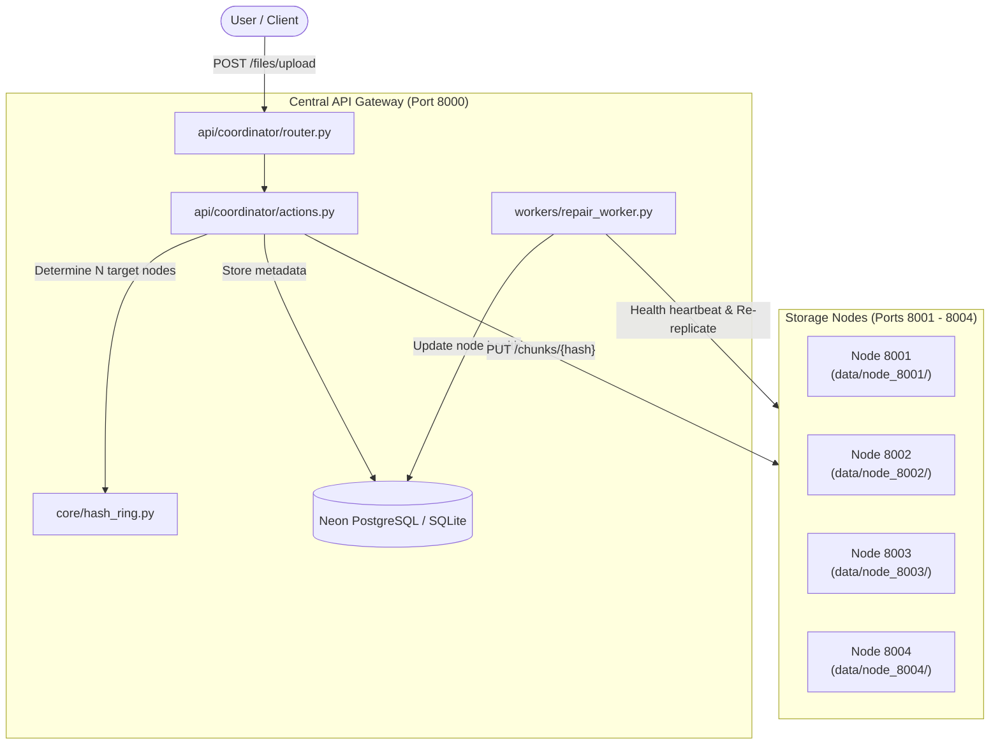

Viewed run_cluster.py:1-116
Listed directory vault_backend
Listed directory vault
Listed directory api

# System Architecture: Vault Distributed Object Storage

**Vault** is a **fault-tolerant, distributed object storage system** (conceptually similar to AWS S3 or MinIO). It breaks large files into fixed-size cryptographic chunks (SHA-256), distributes primary and replica copies across independent storage daemon nodes using a **Consistent Hash Ring**, and self-heals in the background if any storage node crashes.

---

## 1. High-Level Architectural Flow

---

## 2. Directory & File Breakdown

### Root Directory

| File / Folder | Purpose |
| :--- | :--- |
| [`run_cluster.py`](file:///Users/amitpajiyar/Desktop/AWS/vault_backend/run_cluster.py) | **One-click local cluster launcher**. Spawns 4 storage node daemons (`8001`–`8004`), creates their disk directories (`data/node_*`), boots the Coordinator on port `8000`, and handles clean shutdown on `Ctrl+C`. |
| [`neon.ts`](file:///Users/amitpajiyar/Desktop/AWS/vault_backend/neon.ts) | **Neon database infrastructure policy**. Declares serverless PostgreSQL configuration and connects to Neon cloud. |
| [`.env.local`](file:///Users/amitpajiyar/Desktop/AWS/vault_backend/.env.local) | **Live database credentials**. Automatically populated by `neon deploy` with your Neon PostgreSQL connection string (`DATABASE_URL`). |
| [`.env.example`](file:///Users/amitpajiyar/Desktop/AWS/vault_backend/.env.example) | Template defining configurable ports, replication factors, and default database fallback settings. |
| [`docker-compose.yml`](file:///Users/amitpajiyar/Desktop/AWS/vault_backend/docker-compose.yml) | Multi-container setup running coordinator and 4 storage nodes in isolated Docker containers with shared networking and persistent volumes. |
| [`Dockerfile.coordinator`](file:///Users/amitpajiyar/Desktop/AWS/vault_backend/Dockerfile.coordinator) & [`Dockerfile.storage`](file:///Users/amitpajiyar/Desktop/AWS/vault_backend/Dockerfile.storage) | Minimal, production-ready container images for the Coordinator and Storage Node Daemons. |
| [`pyproject.toml`](file:///Users/amitpajiyar/Desktop/AWS/vault_backend/pyproject.toml) | Python project package definition, dependencies (`fastapi`, `uvicorn`, `sqlalchemy`, `asyncpg`, `httpx`), and pytest settings. |

---

### Core Engine: `src/vault/core/`

The backbone algorithms and foundational configurations of the cluster.

| File | Responsibilities |
| :--- | :--- |
| [`config.py`](file:///Users/amitpajiyar/Desktop/AWS/vault_backend/src/vault/core/config.py) | **Central Configuration (Pydantic)**. Defines chunk size (default 4MB), replication factor ($N=3$), virtual node count ($V=100$), node ports, and automatically parses Neon PostgreSQL URLs for AsyncIO. |
| [`database.py`](file:///Users/amitpajiyar/Desktop/AWS/vault_backend/src/vault/core/database.py) | **SQLAlchemy Async Engine & Session Manager**. Creates the database connection pool, provides session lifecycle (`get_db`), and runs automatic table creation (`init_db`). |
| [`hash_ring.py`](file:///Users/amitpajiyar/Desktop/AWS/vault_backend/src/vault/core/hash_ring.py) | **Consistent Hash Ring with Virtual Nodes**. Hashes chunk keys using MD5 and maps them clockwise onto the ring. Distributes load uniformly and provides $N$ distinct replica nodes for each chunk. Supports dynamic node addition and removal. |

---

### ORM Models: `src/vault/models/`

PostgreSQL/SQLite tables mapping metadata:

| File | Model & Table | What It Stores |
| :--- | :--- | :--- |
| [`file.py`](file:///Users/amitpajiyar/Desktop/AWS/vault_backend/src/vault/models/file.py) | `FileRecord` (`files`) | Stores overall file details: `file_id` (UUID), `filename`, `total_size`, `total_chunks`, and creation timestamp. |
| [`chunk.py`](file:///Users/amitpajiyar/Desktop/AWS/vault_backend/src/vault/models/chunk.py) | `ChunkRecord` (`chunk_metadata`) | Maps each chunk: `chunk_hash` (SHA-256), sequence index, `primary_node_url`, and JSON list of `replica_node_urls`. |
| [`node.py`](file:///Users/amitpajiyar/Desktop/AWS/vault_backend/src/vault/models/node.py) | `NodeStatusRecord` (`node_status`) | Tracks storage node state: `node_url`, `is_healthy` (True/False), `last_seen` timestamp, and `storage_used_bytes`. |

---

### Pydantic Schemas: `src/vault/schemas/`

Validation and serialization for API requests and responses:

| File | Schemas |
| :--- | :--- |
| [`file.py`](file:///Users/amitpajiyar/Desktop/AWS/vault_backend/src/vault/schemas/file.py) | `FileUploadResponse`, `FileInfoResponse`, `FileListResponse` |
| [`chunk.py`](file:///Users/amitpajiyar/Desktop/AWS/vault_backend/src/vault/schemas/chunk.py) | `ChunkUploadResponse`, `ChunkMetadataResponse` |
| [`cluster.py`](file:///Users/amitpajiyar/Desktop/AWS/vault_backend/src/vault/schemas/cluster.py) | `NodeHealthResponse`, `ClusterStatusResponse` |

---

### Entry Points & API Layer: `src/vault/` & `src/vault/api/`

| File | Role |
| :--- | :--- |
| [`coordinator_main.py`](file:///Users/amitpajiyar/Desktop/AWS/vault_backend/src/vault/coordinator_main.py) | **Coordinator Entry Point**. Initializes database tables on startup, initializes the `ConsistentHashRing`, launches the background `repair_worker`, mounts API routers, and shuts down background tasks cleanly. |
| [`api/coordinator/router.py`](file:///Users/amitpajiyar/Desktop/AWS/vault_backend/src/vault/api/coordinator/router.py) | **Public REST API**. Exposes endpoints for clients: `POST /files/upload`, `GET /files/{id}/download`, `GET /files`, `GET /cluster/status`. |
| [`api/coordinator/actions.py`](file:///Users/amitpajiyar/Desktop/AWS/vault_backend/src/vault/api/coordinator/actions.py) | **Orchestration Brain**:  • Ingests file streams and splits them into 4MB chunks. • Computes SHA-256 digests. • Queries `HashRing` for target primary and replica nodes. • Sends chunks via HTTP `PUT` concurrently to storage nodes. • Reassembles chunks in sequence on download, with automatic failover to replica nodes if primary node is unreachable. |
| [`daemon_main.py`](file:///Users/amitpajiyar/Desktop/AWS/vault_backend/src/vault/daemon_main.py) | **Storage Node Daemon CLI**. Accepts `--port` and `--data-dir` arguments and runs a lightweight FastAPI instance dedicated exclusively to disk I/O. |
| [`api/storage/router.py`](file:///Users/amitpajiyar/Desktop/AWS/vault_backend/src/vault/api/storage/router.py) | **Storage Node Endpoints**:  • `PUT /chunks/{hash}`: Writes chunk directly to `{data_dir}/{hash}.bin`. • `GET /chunks/{hash}`: Streams chunk from disk. • `DELETE /chunks/{hash}`: Deletes chunk. • `GET /health`: Reports health status, free disk space, and chunk count. |

---

### Fault Tolerance & Self-Healing: `src/vault/workers/`

| File | What It Does |
| :--- | :--- |
| [`repair_worker.py`](file:///Users/amitpajiyar/Desktop/AWS/vault_backend/src/vault/workers/repair_worker.py) | **Active Self-Healing Loop**: Runs asynchronously in the background.  1. Pings all storage nodes periodically (`HEARTBEAT_INTERVAL_SECONDS`). 2. Marks offline nodes as unhealthy in the database and removes them from the Hash Ring. 3. Scans for under-replicated chunks. 4. Re-replicates missing chunks from healthy nodes to new target nodes to maintain the replication factor ($N=3$). |

---

### Automated Test Suite: `tests/`

| File | Coverage |
| :--- | :--- |
| [`conftest.py`](file:///Users/amitpajiyar/Desktop/AWS/vault_backend/tests/conftest.py) | Sets up temporary directories, in-memory test databases, mock node clusters, and Async HTTP clients. |
| [`test_hash_ring.py`](file:///Users/amitpajiyar/Desktop/AWS/vault_backend/tests/test_hash_ring.py) | Tests consistent hashing distribution, virtual node scaling, replication placement, and node churn. |
| [`test_integration.py`](file:///Users/amitpajiyar/Desktop/AWS/vault_backend/tests/test_integration.py) | End-to-end tests for upload, download, SHA-256 chunk integrity, node failover, replica failover, and cluster status. |

---

## 3. How a Request Flows End-to-End

### Upload Lifecycle:
1. **Client** calls `POST http://localhost:8000/files/upload` with a file.
2. [`actions.py`](file:///Users/amitpajiyar/Desktop/AWS/vault_backend/src/vault/api/coordinator/actions.py) reads the stream and chops it into 4MB pieces.
3. For each piece, it computes `SHA-256`.
4. It calls [`hash_ring.get_nodes(chunk_hash, count=3)`](file:///Users/amitpajiyar/Desktop/AWS/vault_backend/src/vault/core/hash_ring.py), which selects 1 Primary node and 2 Replica nodes.
5. Coordinator sends `PUT /chunks/{hash}` concurrently to all 3 nodes via `httpx`.
6. Nodes write `{hash}.bin` to their local folder.
7. Metadata is committed to **Neon PostgreSQL** via `FileRecord` and `ChunkRecord`.

### Download Lifecycle:
1. **Client** calls `GET http://localhost:8000/files/{file_id}/download`.
2. Coordinator fetches all `ChunkRecord` entries ordered by `chunk_index`.
3. For each chunk, it tries to stream from `primary_node_url`. If that node is down, it **automatically fails over** to the replica URLs.
4. Streams back the reconstructed file to the user.